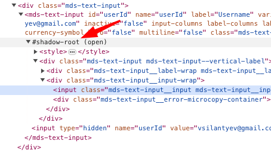

Extension V3 - написание парсеров
-----------------------------------

Стартовая страница для написания парсеров:
http://parserbox-web.awardwallet.docker:38401/admin/debug-extension

Если расширение браузера еще не установлено - будет показана иструкция по установке.

Обратите внимание, что домен должен быть parserbox-web.awardwallet.docker. 
На другом домене работать не будет, пропишите в hosts, согласно [инструкции](../README.md#hosts).

Парсер создается в папке провайдера (src/engine/providercode) как файл с названием ProvidercodeExtension.php, содержащий класс ProvidercodeExtension.

Должен реализовывать интерфейсы LoginWithIdInterface и ParseInterface.
Если провайдер делает только автологин, без сбора данных - достаточно LoginWithIdInterface

Пример:
[src/engine/etihad/EtihadExtension.php](https://github.com/AwardWallet/engine/blob/master/etihad/EtihadExtension.php)
```php
class EtihadExtension extends AbstractParser implements LoginWithIdInterface, ParseInterface, ParseItinerariesInterface, ParseHistoryInterface {
    // реализуйте методы интерфейсов
}
```
Далее нужно реализовать методы описанные в [LoginWithIdInterface](https://github.com/AwardWallet/extension-worker/blob/master/src/LoginWithIdInterface.php) 
и [ParseInterface](https://github.com/AwardWallet/extension-worker/blob/master/src/ParseInterface.php)

Общая логика работы парсера:

1. **getStartingUrl()**
2. **isLoggedIn()** ?
   - Да:
     - **getLoginId()**
     - loginId Совпадает с записанным с прошлой проверки?
       - Да: переходим к **parse()**
       - Нет: **logout()**
       - После logout() происходит автоматический переход по URL указанному в getStartingUrl()
   - Нет: 
     - **login()**
3. **parse()**
4. **parseItineraries()**
5. **parseistory()**

При парсинге собранные данные записывайте в объект $master переданный в метод parse
```php
// Используйте создание Statement один раз
$st = $master->createStatement();
// Name
$st->addProperty('Name', '');
// При необходимости, используйте ранее созданный Statement
$st = $master->getStatement();
```

### Основные методы для сбора данных
**evaluate** - поддерживает XPath запросы c возможностью кликать, вставлять значения и т.д. Возвращает Element.
Ждет наличия элемента на станице и выкидывает исключение ElementNotFoundException при его отсутствии.
```php
$tab->evaluate('//img', EvaluateOptions::new()
    ->nonEmptyString() // Искомый элемент на странице может присутствывать, но текст может загрузиться через время. Эта опция заставит ждать появления текста в элементе
    ->contextNode($root) // Родительский элемент
    ->visible(true) // По умолчанию true, ждет пока элемент не станет видимым
    ->timeout(15) // Время ожидания, через которое запрос упадет по таймауту
    ->allowNull(true) // Отключает выбрасывание исключения если искомый элемент не обнаружен. Имейте ввиду что, timeout с этой опцией по умолчанию "0"
);
```

**findText** - поддерживает XPath запросы. Возвращает string. Дает возможность получить текстовую метку из тегов и их атрибутов.
Ждет наличия элемента на станице и выкидывает исключение ElementNotFoundException при его отсутствии
```php 
$tab->findText('//img/@src', FindTextOptions::new() // Тоже что и EvaluateOptions но есть preg
    ->preg('/^([\d.,]+) Miles/') // Регулярные выражения
)     
```
**findTextNullable** - тоже самое что и findText но поумолчанию timeout 0 - это значит, что метод не ждет появления элемента и не выкидывает исключения, если элемент не найден.
```php
$tab->findTextNullable('//img/@src', FindTextOptions::new()->timeout(60))    
```


**evaluateAll, findTextAll** - Могут найти на странице один и более элементов
На данный момент, запросы НЕ ждут появления элемента, поэтому, перед их вызовом следует
использовать evaluate или findText
```php
$tab->evaluateAll() // array Element
$tab->findTextAll() // array String
 
// Логика работы как у $tab->evaluate, но запросы как у document.querySelector в JavaScript
$tab->querySelector('div.user-panel:not(.main) input[name="login"]')
```

**waiter->waitFor** - ожидание появления / исчезновения чего либо

```php
// ожидание исчезновения элемента
$result = $this->waiter->waitFor(function() use ($tab) {
    return !$tab->evaluate('//iframe[@id="sec-cpt-if"]', EvaluateOptions::new()->allowNull(true)->timeout(0));
});
```

**watchdogControl->increaseTimeLimit();** - увеличение времени выполнения парсера

```php
$this->watchdogControl->increaseTimeLimit(30);
```

### Навигация по сайту
```php
$tab->evaluate('//a[@id="nav"]')->click();
$tab->gotoUrl('http://');
$tab->back();
```

### Выполнение API запросов
https://github.com/JakeChampion/fetch
```php
$options = [
    'aw-no-cors' => false, // по умолчанию false
     // если true то это включит выполнение запросов не со страницы провайдера,
     // а из background-a самого экстеншена, этот запрос должен выполниться без CORS policy
    'method'  => 'post',
    'headers' => [
        'Accept'        => 'application/json, text/plain, */*',
        'Content-Type'  => 'application/json',
        //'Content-Type' => 'application/x-www-form-urlencoded',
    ],
    'body' => json_encode(['param'=>'value']),
    //'body' => http_build_query(['param'=>'value'])
];

$json = $tab->fetch("https://www.site.com/api", $options)->body;
$this->logger->info($json);
$json = json_decode($json);
```
### Выбор клиентской проверки для отдельных регионов ###

Это аналог конструкции isClientCheck в старых парсерах.

На примере etihad:

Создайте класс EtihadExtensionOptions.
Класс должен реализовать ParseAllowedInterface:
```php
namespace AwardWallet\Engine\etihad;

use AwardWallet\ExtensionWorker\ParseAllowedInterface;

class EtihadExtensionOptions implements ParseAllowedInterface
    public function isParseAllowed(AccountOptions $options) : bool
    {
        return in_array($options->login2, ['USA', 'Canada']);
    }
}
```

### Выбор регионов

Возможно создавать разные парсеры для разных регионов.

Создайте класс вида 
```php
<?php

namespace AwardWallet\Engine\chase;

use AwardWallet\ExtensionWorker\ParserSelectorInterface;
use AwardWallet\ExtensionWorker\SelectParserRequest;
use Psr\Log\LoggerInterface;

class ChaseExtensionParserSelector implements ParserSelectorInterface
{
    public function selectParser(SelectParserRequest $request, LoggerInterface $logger): string
    {
        if ($request->getLogin2() === 'canada') {
            return ChaseExtensionCanada::class;
        }

        return ChaseExtension::class;
    }
}
```
Будет использован другой парсер для канады.

### Работа с фреймами
```php
$frame = $tab->selectFrameContainingSelector("//input[@name='userId']", SelectFrameOptions::new()->method("evaluate"));
$loginLabel = $frame->querySelector('label#userId-label');
$loginLabel->click();
```
Обратите внимание, что в метод selectFrameContainingSelector передается селектор внутри фрейма, 
сам фрейм указывать в селекторе не надо.
```php
$frame = $tab->selectFrameContainingSelector("//input[@name='userId']", SelectFrameOptions::new()->method("evaluate")); // правильно
$frame = $tab->selectFrameContainingSelector("//iframe//input[@name='userId']", SelectFrameOptions::new()->method("evaluate")); // неправильно

```

### Работа с Shadow DOM

Бывает что часть элементов на странице находится в Shadow DOM.
Вы можете увидеть это в инспекторе хрома, если у одного из родителей элемента есть отметка #shadow-root


Подробнее о shadow DOM:
https://developer.mozilla.org/en-US/docs/Web/API/Web_components/Using_shadow_DOM

Такие элементы нельзя найти через querySelector или evaluate.
Их надо искать через свойство shadowRoot у элемента, в котором они находятся.
Пример:
```php
// нашли элемент на котором висит отметка #shadow-root
$loginInputShadowRoot = $tab->querySelector("mds-text-input")->shadowRoot();
// выполняем селекторы внутри этого элемента
$loginInput = $loginInputShadowRoot->querySelector("input");
$loginInput->setValue($credentials->getLogin());
```

### Показ сообщений

```php
$tab->showMessage(Tab::MESSAGE_RECAPTCHA);
```

### Парсинг всех данных в одном методе

Иногда трудно разделить сбор истории, резерваций и баланса на методы parse, parseHistory, parseItineraries.
В этом случае можно использовать интерфейс parseAll. Пример такого парсера:

```php
namespace AwardWallet\Engine\testprovider;

use AwardWallet\ExtensionWorker\AbstractParser;
use AwardWallet\ExtensionWorker\AccountOptions;
use AwardWallet\ExtensionWorker\Credentials;
use AwardWallet\ExtensionWorker\LoginResult;
use AwardWallet\ExtensionWorker\LoginWithIdInterface;
use AwardWallet\ExtensionWorker\ParseAllInterface;
use AwardWallet\ExtensionWorker\ParseHistoryOptions;
use AwardWallet\ExtensionWorker\ParseItinerariesOptions;
use AwardWallet\ExtensionWorker\Tab;
use AwardWallet\Schema\Parser\Component\Master;

class TestproviderExtension extends AbstractParser implements LoginWithIdInterface, ParseAllInterface
{

    public function getStartingUrl(AccountOptions $options): string
    {
        return 'https://yandex.ru';
    }

    public function isLoggedIn(Tab $tab): bool
    {
        // TODO: Implement isLoggedIn() method.
        return false;
    }

    public function getLoginId(Tab $tab): string
    {
        // TODO: Implement getLoginId() method.
        return '';
    }

    public function logout(Tab $tab): void
    {
        // TODO: Implement logout() method.
    }

    public function login(Tab $tab, Credentials $credentials): LoginResult
    {
        return LoginResult::success();
    }

    public function parseAll(Tab $tab, Master $master, AccountOptions $accountOptions, ?ParseHistoryOptions $historyOptions, ?ParseItinerariesOptions $itinerariesOptions): void
    {
        // собираем все данные в одном методе
        $master->createStatement()->setBalance(100);
        $master->createFlight()->addConfirmationNumber('123');
        $master->getStatement()->addActivityRow(['PostingDate' => '2021-01-01', 'Description' => 'Test', 'Amount' => 100]);
    }
}
```

Параметры $historyOptions и $itinerariesOptions могут быть null - это означает что парсинг
истории/резерваций запускать не надо.

### Управление фокусом вкладки

Вкладка открываемая для автологина активна всегда.

Когда для парсинга открывается новая вкладка - она по умолчанию неактивна.

Некоторые провайдеры не загружаются в фоновой вкладке, или требуют решения капчи.
В этом случае вы можете сделать открываемую вкладку активной реализовав интерфейс ActiveTabInterface:

```php
class ChaseExtension extends AbstractParser implements ..., ActiveTabInterface

...

    public function isActiveTab(AccountOptions $options): bool
    {
        return true;
    }

}
```

### Выброс стандартных ошибок ###

```php
throw new NotAMemberException();
throw new ProfileUpdateException();
throw new AcceptTermsException();
 
```

### Автологин в резервацию ###

Автологин пользователя на страницу резервации используя поля вида RecordLocator, First Name, Last Name.
Реализуйте интерфейс LoginWithConfNoInterface:

```php
class ChaseExtension extends AbstractParser implements ... LoginWithConfNoInterface
{
    public function getLoginWithConfNoStartingUrl(array $confNoFields): string
    {
        return 'https://yandex.ru';
    }

    public function loginWithConfNo(Tab $tab, array $confNoFields): LoginWithConfNoResult
    {
        $this->logger->info("loginWithConfNo", $confNoFields);
        
        // return LoginWithConfNoResult::error("Reservations were not found"); 

        return LoginWithConfNoResult::success();
    }
}
```

Массив confNoFields приходит в виде:
```php
[
    'RecordLocator' => '123456',
    'FirstName' => 'John',
    'LastName' => 'Doe',
]
```
Названия полей приведены для примера. Реальные поля смотрите в functions.php, метод GetConfirmationFields.

### Парсинг резерваций по номеру ###

Сбор резерваций используя поля вида RecordLocator, First Name, Last Name.
Дополнительно к интерфейсу LoginWithConfNoInterface (описан выше) реализуйте RetrieveByConfNoInterface:

```php
class ChaseExtension extends AbstractParser implements ... LoginWithConfNoInterface, RetrieveByConfNoInterface
{
    public function retrieveByConfNo(Tab $tab, Master $master, array $fields, ConfNoOptions $options): void
    {
        // заполните собранные резервации через $master
        $master->createFlight()->addConfirmationNumber('123');
    }
}
```

Массив confNoFields приходит в виде:
```php
[
    'RecordLocator' => '123456',
    'FirstName' => 'John',
    'LastName' => 'Doe',
]
```

Включите опцию "Retrieve By Conf No V3" для провайдера в админке.

### Серверная проверка ###

Если провайдер требует серверной проверки через v3, создайте в папке провайдера конфиг серверной проверки вида:
```php
<?php

namespace AwardWallet\Engine\british;

use AwardWallet\ExtensionWorker\AbstractServerConfig;
use AwardWallet\ExtensionWorker\AccountOptions;

class BritishExtensionServerConfig extends AbstractServerConfig
{

    public function configureServerCheck(?AccountOptions $accountOptions, \SeleniumFinderRequest $seleniumRequest, \SeleniumOptions $seleniumOptions): bool
    {
        if ($accountOptions->login === 'veresch') {
            // установка прокси
            $seleniumOptions->setProxy($this->proxyManager->get(new GoProxiesRequest(GoProxiesRequest::COUNTRY_US)));
        
            return true;
        }

        return false;
    }
}
```
Здесь вы можете пустить серверную проверку через v3 в зависимости от разных параметров - логина, регионов, и так же выбрать какой селениум браузер, прокси будут
использоваться для проверки.

В данный момент для серверной проверки доступен только один браузер: chrome-extension:104.

Распознавание капчи для серверной проверки делается так:
https://github.com/AwardWallet/engine/blob/96f91f43b0f58432b9fbb733aee8280a7cdb5ec0/british/BritishExtension.php#L139-L139
Приходится делать ветвления, для клиентской проверки мы просим пользователя решить капчу, для серверной - решаем сами через сторонние сервисы.
На данный момент поддерживается распознавание через rucapctha

### Автоматический ввод one-time кодов, если у пользователя подключен ящик ###

Пример в airfrance:
Вот отправка кода на email:
https://github.com/AwardWallet/engine/blob/cc278d65cef87aeff7835f4362ffbb77db71e060/airfrance/AirfranceExtension.php#L155-L155

Вот ввод кода:
https://github.com/AwardWallet/engine/blob/cc278d65cef87aeff7835f4362ffbb77db71e060/airfrance/AirfranceExtension.php#L992-L992

Ключевые моменты:

- проверяем что у пользователя подключен ящик, и это не фоновая проверка: $this->context->isMailboxConnected() && !$this->context->isBackground()
- оставляем окно открытым: $this->stateManager->keepBrowserSession(true)
- возвращаем LoginResult::question

Исполнение будет продолжено в методе continueLogin, где надо будет ввести код, код будет доступен в $credentials->getAnswers()

### Контекст  ###
```php
$this->context->isServerCheck() // true - серверная проверка. false - клиентская проверка
$this->context->isBackground() // true - проверка происходит в фоне. false - серверная/клиентская инициированная юзером
$this->context->isMailboxConnected() // Если подключен mailbox и не важно какая проверка серверная/клиентская
$this->context->isMobile() - // Если проверка через мобильное приложение
$this->context->getProviderInfo() - // TODO
```